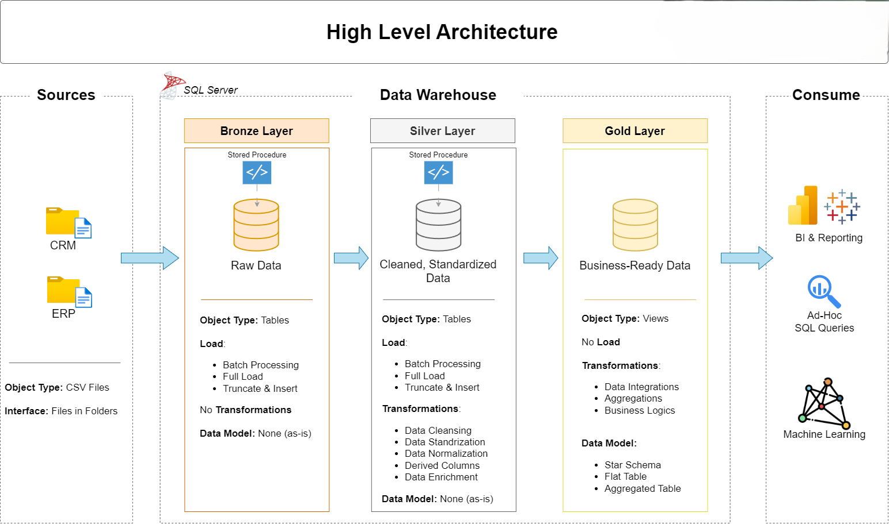
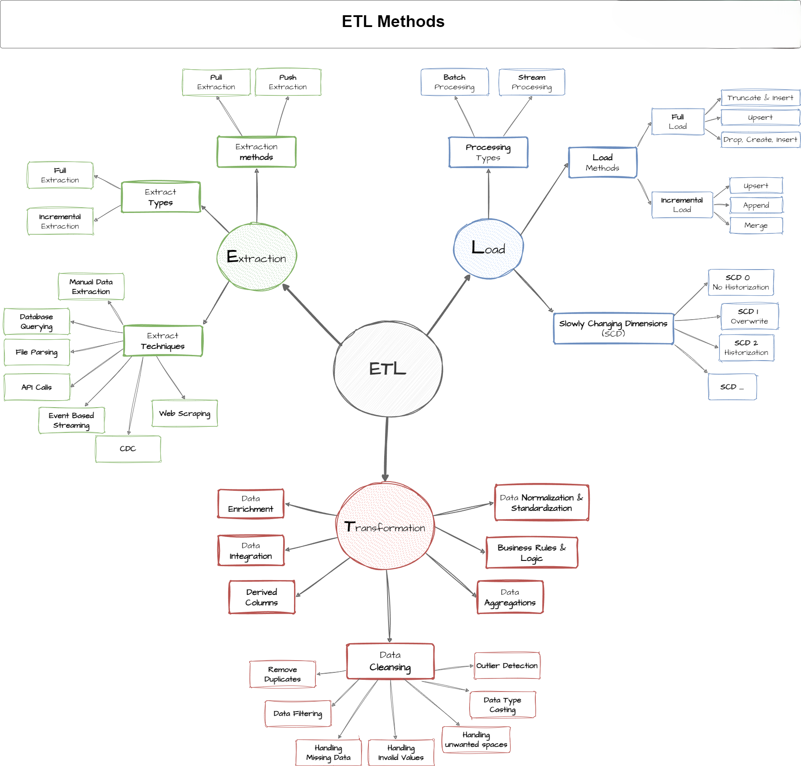
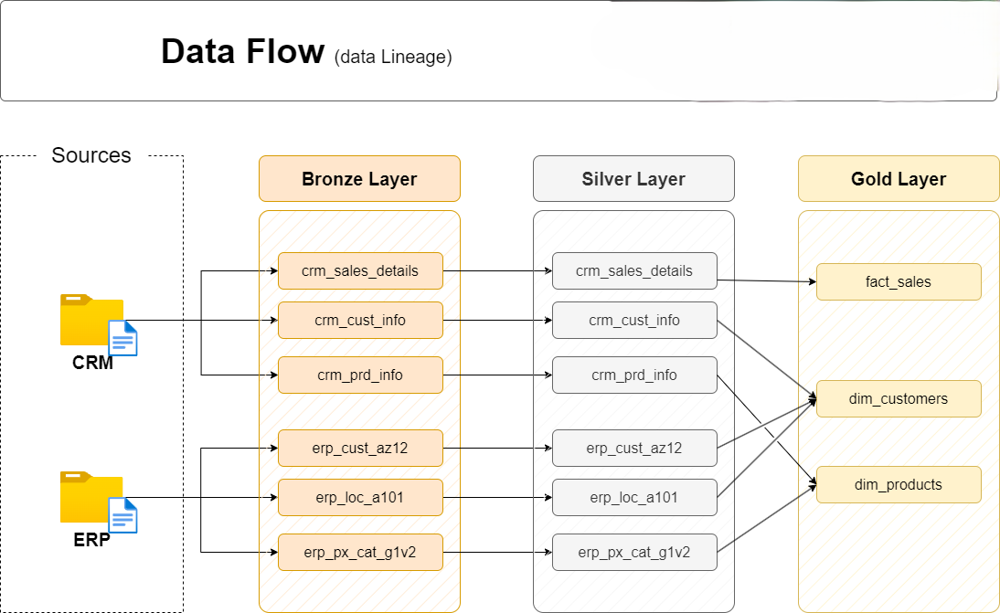
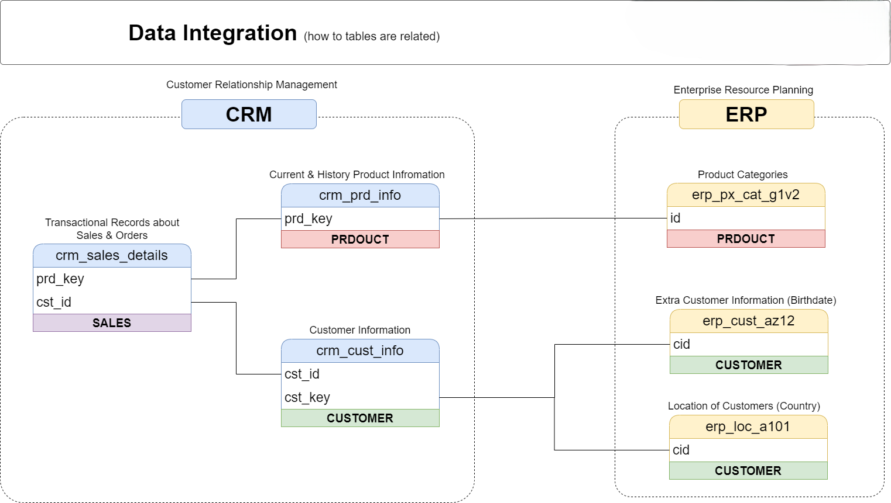
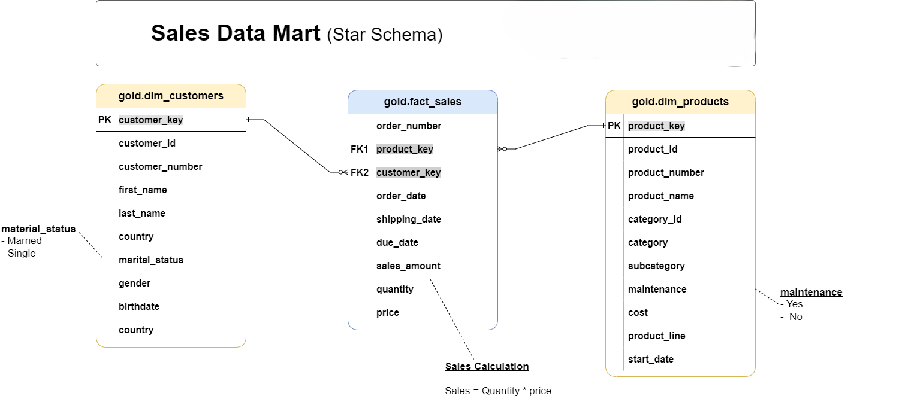

# SQL Data Warehouse Project: Sales & Customer Analytics

## Project Overview

This project demonstrates the design, implementation, and analysis of a SQL Data Warehouse (DWH) focused on sales and customer data. It involves integrating data from various sources (ERP and CRM), transforming it into a structured format, and building analytical reports and interactive dashboards to drive business insights.

The core objective is to provide a robust and scalable data foundation for informed decision-making regarding sales performance, customer behavior, and product trends.

## Features

* **Multi-Source Data Integration:** Combines data from ERP (Product, Location, Customer) and CRM (Sales Details, Product Info, Customer Info) systems.
* **Layered Data Architecture (Medallion Architecture):** Implements Bronze, Silver, and Gold layers for data ingestion, cleaning, and business-ready modeling.
    * **Bronze Layer:** Raw data ingestion from CSV files into a SQL Server database.
    * **Silver Layer:** Data cleansing, standardization, and normalization processes.
    * **Gold Layer:** Business-ready data modeled into a star schema for reporting and analytics.
* **ETL Processes:** Stored procedures for efficient data loading and transformation between layers.
* **Data Quality Checks:** SQL scripts for validating data integrity and quality at various stages.
* **SQL-based Data Analytics:** A comprehensive set of SQL queries for various analytical tasks (e.g., trend analysis, ranking, segmentation, reporting).
* **Interactive Tableau Dashboards:** Visualizations built on top of the Gold layer to offer dynamic insights into sales and customer data.

## Project Structure

sql_dwh_project/
├── .gitignore
├── LICENSE
├── README.md                  <- This file
├── SQL Data Warehouse Project Planning Notion.pdf
├── docs/
│   ├── data_architecture.png
│   ├── data_catalog.md
│   ├── data_flow.png
│   ├── data_integration.png
│   ├── data_layers.pdf
│   ├── data_model.png
│   ├── ETL.png
│   └── naming_conventions.md
├── datasets/
│   ├── sourse_erp/
│   │   ├── CUST_AZ12.csv
│   │   ├── LOC_A101.csv
│   │   └── PX_CAT_G1V2.csv
│   └── source_crm/
│       ├── cust_info.csv
│       ├── prd_info.csv
│       └── sales_details.csv
├── SQL_Scripts/
│   ├── Bronze_Layer/
│   │   ├── ddl_bronze.sql
│   │   └── proc_load_bronze.sql
│   ├── Gold_Layer/
│   │   └── ddl_gold.sql
│   ├── Silver_Layer/
│   │   ├── ddl_silver.sql
│   │   └── proc_load_silver.sql
│   ├── Tests/
│   │   ├── quality_checks_gold.sql
│   │   └── quality_checks_silver.sql
│   └── init_database.sql
├── SQL_Data_Analytics/
│   ├── 01_database_exploration.sql
│   ├── 02_dimensions_exploration.sql
│   ├── 03_date_range_exploration.sql
│   ├── 04_measures_exploration.sql
│   ├── 05_magnitude_analysis.sql
│   ├── 06_ranking_analysis.sql
│   ├── 07_change_over_time_analysis.sql
│   ├── 08_cumulative_analysis.sql
│   ├── 09_performance_analysis.sql
│   ├── 10_data_segmentation.sql
│   ├── 11_part_to_whole_analysis.sql
│   ├── 12_report_customers.sql
│   ├── 13_report_products.sql
│   ├── Roadmap.png
│   └── s  (Note: This file appears to be a placeholder or incomplete. Please verify.)
└── Dashboards/             <- New directory for Tableau assets
├── Sales Dashboard.png
├── Customer Dashboard.png
└── Sales_Dashboard.twbx  (Example: Replace with your actual Tableau workbook files)
└── Customer_Dashboard.twbx (Example: Replace with your actual Tableau workbook files)
└── Filter_Example.png   (Your filter image)

## Getting Started

To set up and run this project locally, follow these steps:

### Prerequisites

* **SQL Server:** An instance of SQL Server (or a compatible SQL database) to host the data warehouse.
* **SQL Server Management Studio (SSMS)** or a similar SQL client.
* **Tableau Desktop:** To open and interact with the `.twbx` dashboard files.

### 1. Database Setup

1.  **Initialize the Database:**
    * Open `SQL_Scripts/init_database.sql` in SSMS.
    * Execute the script to create the necessary database and schemas.

2.  **Load Bronze Layer:**
    * Place the CSV files from `datasets/sourse_erp/` and `datasets/source_crm/` into a directory accessible by SQL Server (e.g., a shared network drive or a folder configured for bulk insert).
    * Open `SQL_Scripts/Bronze_Layer/ddl_bronze.sql` and `SQL_Scripts/Bronze_Layer/proc_load_bronze.sql`.
    * Execute `ddl_bronze.sql` to create the bronze layer tables.
    * Execute `proc_load_bronze.sql` to load data from the CSV files into the bronze layer. **Remember to update the file paths in `proc_load_bronze.sql` to match your local setup.**

3.  **Load Silver Layer:**
    * Open `SQL_Scripts/Silver_Layer/ddl_silver.sql` and `SQL_Scripts/Silver_Layer/proc_load_silver.sql`.
    * Execute `ddl_silver.sql` to create the silver layer tables.
    * Execute `proc_load_silver.sql` to transform and load data from the bronze layer into the silver layer.

4.  **Load Gold Layer:**
    * Open `SQL_Scripts/Gold_Layer/ddl_gold.sql`.
    * Execute `ddl_gold.sql` to create the gold layer (star schema) tables.
    * *(Note: The `proc_load_gold.sql` is typically derived from the `SQL_Data_Analytics` queries or integrated into a more complex ETL orchestration. If you have a separate procedure for loading gold, please add it here.)*

### 2. Data Quality Checks

* Navigate to `SQL_Scripts/Tests/`.
* Execute `quality_checks_silver.sql` and `quality_checks_gold.sql` to ensure data integrity and validate the transformation process. Review the results for any anomalies.

### 3. Data Analysis (SQL)

The `SQL_Data_Analytics/` directory contains various SQL queries for in-depth analysis of the data in the Gold layer. Explore these scripts to understand:
* `01_database_exploration.sql`: Initial exploration of the database.
* `02_dimensions_exploration.sql`: Understanding dimensions in the data.
* `03_date_range_exploration.sql`: Analyzing data across different time periods.
* `04_measures_exploration.sql`: Exploring key performance indicators (KPIs).
* `05_magnitude_analysis.sql`: Analyzing the scale of different metrics.
* `06_ranking_analysis.sql`: Ranking entities based on performance.
* `07_change_over_time_analysis.sql`: Tracking trends and changes over time.
* `08_cumulative_analysis.sql`: Calculating running totals and cumulative metrics.
* `09_performance_analysis.sql`: Deeper dives into sales and customer performance.
* `10_data_segmentation.sql`: Segmenting customers or products.
* `11_part_to_whole_analysis.sql`: Understanding contributions of parts to a whole.
* `12_report_customers.sql`: Customer-centric reporting queries.
* `13_report_products.sql`: Product-centric reporting queries.

### 4. Tableau Dashboards

Interactive dashboards provide a visual interface to explore the data warehouse's insights.

**To view the dashboards:**

1.  **Download Tableau Workbooks:**
    * If you have the `.twbx` files, download `Sales_Dashboard.twbx` and `Customer_Dashboard.twbx` (or your actual file names) from the `Dashboards/` directory of this repository.
2.  **Open in Tableau Desktop:**
    * Open these `.twbx` files using Tableau Desktop. The packaged workbooks contain the data extract, so no direct database connection setup is required initially.
3.  **Connecting to Live Data (Optional):**
    * If you wish to connect these dashboards to your live SQL Data Warehouse, you will need to edit the data source connection within Tableau Desktop, pointing it to your SQL Server instance and the Gold layer tables. Ensure you have the necessary database credentials.

#### Sales Dashboard

This dashboard provides a comprehensive view of sales performance, including total sales, sales trends over time, sales by product category, and regional sales distribution.

#### Customer Dashboard

The customer dashboard offers insights into customer behavior, top customers, customer segmentation, and geographical distribution of customers.

#### Dashboard Filter Example

Dashboards often include various filters to allow users to drill down and customize their view. Here's an example of a filter being applied:

## Documentation & Architecture

The `docs/` directory contains essential project documentation and architectural diagrams:

* **Overall Data Architecture:** A high-level view of the entire data pipeline.
    
* **ETL Process Flow:** Visualizing the Extract, Transform, Load operations.
    
* **Data Flow:** Illustrates the movement of data between different components.
    
* **Data Integration:** Details on how data from various sources is integrated.
    
* **Data Model:** The logical and/or physical data model of the data warehouse.
    
* **Data Catalog:** Documentation of tables, columns, and their descriptions.
    [View Data Catalog](docs/data_catalog.md)
* **Data Layers:** Detailed explanation of the Bronze, Silver, and Gold layers.
    [View Data Layers](docs/data_layers.pdf)
* **Naming Conventions:** Guidelines for naming conventions used throughout the project.
    [View Naming Conventions](docs/naming_conventions.md)
* **Project Planning:** Original planning document for the project.
    [View Project Planning](SQL%20Data%20Warehouse%20Project%20Planning%20Notion.pdf)
* **SQL Data Analytics Roadmap:** Overview of the analytical roadmap.
    

## Contributing

Contributions are welcome! If you have suggestions for improvements, bug fixes, or new features, please open an issue or submit a pull request.

## License

This project is licensed under the [MIT License](LICENSE).
